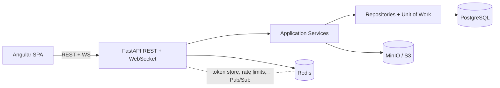

<div align="center">

# 💬 Realtime Chat

**A full-stack real-time private messaging platform with social features.**

[](https://www.python.org/)
[](https://fastapi.tiangolo.com/)
[](https://angular.dev/)
[](https://www.typescriptlang.org/)
[](https://www.postgresql.org/)
[](https://redis.io/)
[](https://www.docker.com/)

[About](#about) • [Architecture](#architecture) • [Tech Stack](#tech-stack) • [Getting Started](#getting-started) • [Project Structure](#project-structure) • [API Overview](#api-overview) • [Frontend](#frontend) • [Testing](#testing)

</div>

---

## About

**Realtime Chat** is a full-stack messaging application that enables real-time private conversations between users, backed by a social layer of friend requests and user discovery.

The project is organized as a monorepo with two independent applications:

- **`backend/`** — An asynchronous Python API powered by FastAPI, exposing REST endpoints and WebSocket connections for real-time message delivery.
- **`frontend/`** — A modern single-page application built with Angular 22 that provides the complete client-side experience.

Both directories contain their own README, tech stack, and development instructions. The root-level documentation here gives a unified overview to help new contributors get oriented quickly.

### Key capabilities

- 🔐 **Authentication** — Registration, login, JWT access/refresh tokens, refresh rotation with reuse detection, and logout with token denylisting.
- ⚡ **Real-time messaging** — WebSocket-based private conversations with Redis Pub/Sub fan-out for horizontal scalability.
- 👥 **Social features** — User search, friend requests (send / accept / reject), and accepted-friend lists.
- 👤 **Profiles** — Biography editing and profile-picture uploads to S3-compatible storage (MinIO).
- 🛡️ **Security** — Argon2 password hashing, conversation-level access control, Redis-backed rate limiting.
- 📱 **Responsive UI** — A mobile-friendly Angular frontend with standalone components, signals, and reactive forms.

---

## Architecture



The backend follows a layered architecture:

| Layer | Purpose |
| --- | --- |
| `app/api` | HTTP/WS endpoints, dependency injection, rate-limit enforcement |
| `app/services` | Business logic (auth, conversations, messages, friendships, profiles) |
| `app/repositories` | Database queries behind repository protocols |
| `app/models` | SQLAlchemy domain models and constraints |
| `app/schemas` | Pydantic request/response contracts |
| `app/websocket` | WebSocket auth, connection lifecycle, and message fan-out |
| `app/adapters` | Infrastructure integrations (MinIO file storage) |

---

## Tech Stack

### Backend

| Component | Technology |
| --- | --- |
| Runtime | Python 3.13+ |
| Framework | FastAPI + Uvicorn |
| Database | PostgreSQL 16 via SQLAlchemy async + asyncpg |
| Cache / Pub-Sub | Redis 7 |
| Object Storage | MinIO (S3-compatible) via boto3 |
| Migrations | Alembic |
| Auth | JWT (PyJWT), Argon2 hashing |
| Package Manager | uv |
| Testing | pytest, pytest-asyncio |
| Linting | ruff |

### Frontend

| Component | Technology |
| --- | --- |
| Framework | Angular 22 |
| Language | TypeScript 6.0 |
| State / Streams | RxJS 7.8, Angular Signals |
| Styling | SCSS |
| Forms | Angular Reactive Forms |
| Testing | Vitest |
| Package Manager | npm |
| Code Quality | Prettier |

---

## Getting Started

### Prerequisites

- [Docker Desktop](https://www.docker.com/products/docker-desktop/)
- [Python 3.12+](https://www.python.org/downloads/) and [uv](https://docs.astral.sh/uv/) *(backend-only development)*
- [Node.js 22+](https://nodejs.org/) and npm *(frontend-only development)*

### 1. Clone the repository

```bash
git clone <repo-url> && cd realtime-chat
```

### 2. Start everything with Docker (recommended)

```bash
cp backend/.env.example backend/.env   # edit if needed
docker compose up --build
```

This starts all services in one command:

| Service | Address | Purpose |
| --- | --- | --- |
| Frontend | `http://localhost:4200` | Angular SPA (nginx proxies API to backend) |
| Backend | `http://localhost:8000` | REST API and WebSocket server |
| API Docs | `http://localhost:8000/docs` | Interactive Swagger documentation |
| PostgreSQL | `localhost:5432` | Application database |
| Redis | `localhost:6379` | Token state, rate limiting, and Pub/Sub |
| MinIO API | `http://localhost:9000` | Profile-picture object storage |
| MinIO Console | `http://localhost:9001` | Local storage administration |

The frontend at `:4200` uses nginx to transparently proxy `/api/` requests and WebSocket connections to the backend — no CORS issues in the browser.

### 3. Run services individually (for development)

You can also run each part separately:

**Backend only** — starts infrastructure + API server:
```bash
cd backend
cp .env.example .env
docker compose up --build
```

**Frontend only** — starts Angular dev server with hot-reload:
```bash
cd frontend
npm install
npm start
```

> For full backend setup details (including running services individually, configuration reference, and environment variables), see **[backend/README.md](./backend/README.md)**.
> For frontend-specific architecture, components, and features, see **[frontend/README.md](./frontend/README.md)**.

---

## Project Structure

```text
.
├── docker-compose.yml        # Full-stack orchestration (recommended)
├── .gitignore                # Root-level ignore patterns
│
├── backend/
│   ├── app/
│   │   ├── adapters/        # MinIO / S3 file storage
│   │   ├── api/v1/          # Versioned REST endpoints
│   │   ├── core/            # Config, security, exceptions
│   │   ├── db/              # Async SQLAlchemy and Redis clients
│   │   ├── models/          # Database entities
│   │   ├── repositories/    # Persistence abstractions
│   │   ├── schemas/         # Pydantic request/response models
│   │   ├── services/        # Business logic
│   │   └── websocket/       # WS auth and connection manager
│   ├── alembic/             # Database migrations
│   ├── tests/               # Unit and integration tests
│   ├── Dockerfile
│   ├── docker-compose.yml   # Backend-only stack
│   └── pyproject.toml
│
├── frontend/
│   ├── src/
│   │   ├── app/             # Components, services, guards, models
│   │   ├── assets/
│   │   └── styles/
│   ├── Dockerfile           # Multi-stage: Node build + nginx
│   ├── nginx.conf           # SPA routing + API/WebSocket proxy
│   ├── docs/screenshots/    # UI screenshots
│   ├── angular.json
│   └── package.json
│
└── README.md                # ← you are here
```

---

## API Overview

All REST routes are prefixed with `/api/v1`. Protected endpoints require `Authorization: Bearer <token>`.

### Auth

| Method | Endpoint | Description |
| --- | --- | --- |
| `POST` | `/api/v1/auth/register` | Create account |
| `POST` | `/api/v1/auth/login` | Get access + refresh tokens |
| `POST` | `/api/v1/auth/refresh` | Rotate refresh token |
| `POST` | `/api/v1/auth/logout` | Revoke tokens |
| `GET` | `/api/v1/auth/me` | Current user info |

### Users, profiles & social

| Method | Endpoint | Description |
| --- | --- | --- |
| `GET` | `/api/v1/users/search?q=` | Search users |
| `GET` | `/api/v1/profile/me` | Get profile |
| `PATCH` | `/api/v1/profile/me` | Update biography |
| `POST` | `/api/v1/profile/me/picture` | Upload profile picture |
| `POST` | `/api/v1/friends/requests/{user_id}` | Send friend request |
| `GET` | `/api/v1/friends/requests` | List pending requests |
| `POST` | `/api/v1/friends/requests/{id}/respond` | Accept / reject |
| `GET` | `/api/v1/friends` | List friends |

### Conversations & messages

| Method | Endpoint | Description |
| --- | --- | --- |
| `POST` | `/api/v1/conversations` | Get or create conversation |
| `GET` | `/api/v1/conversations` | List conversations |
| `POST` | `/api/v1/conversations/{id}/messages` | Send message |
| `GET` | `/api/v1/conversations/{id}/messages` | Read history (cursor pagination) |

### WebSocket

```
ws://localhost:8000/api/v1/ws?token=<ACCESS_TOKEN>
```

Send:
```json
{ "conversation_id": 1, "body": "Hello!" }
```

Receive:
```json
{
  "type": "message",
  "data": {
    "message_id": 1,
    "conversation_id": 1,
    "sender_id": 1,
    "body": "Hello!",
    "created_at": "2026-08-21T12:00:00Z"
  }
}
```

The server also sends application-level `ping` frames when idle — reply with `{"type": "pong"}` to keep the connection alive.

---

## Frontend

The Angular 22 frontend communicates with the backend through two channels:

- **REST API** — authentication, user search, profiles, friends, conversations, and messages.
- **WebSocket** — real-time message delivery.

Built with standalone components, Angular signals, reactive forms, route guards, and HTTP interceptors. See **[frontend/README.md](./frontend/README.md)** for a detailed breakdown.

---

## Testing

### Backend

```bash
cd backend
docker compose up -d test_db minio
uv run pytest
```

Run unit or integration tests separately:

```bash
uv run pytest tests/unit
uv run pytest tests/integration
```

Lint with:

```bash
uv run ruff check .
```

### Frontend

```bash
cd frontend
npm test
```

---

## License

This project is currently unlicensed. Contact the maintainers for usage terms.
