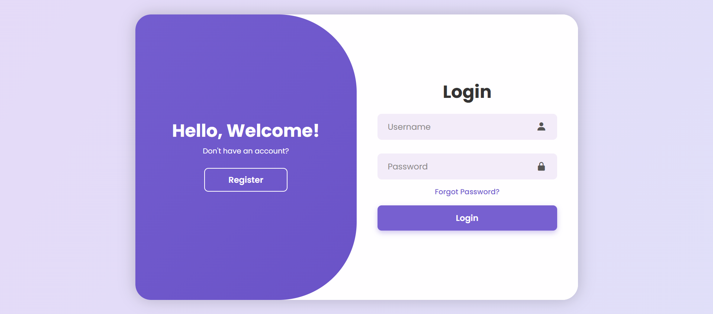
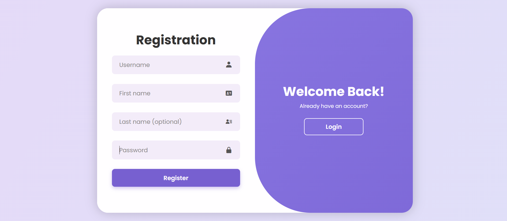
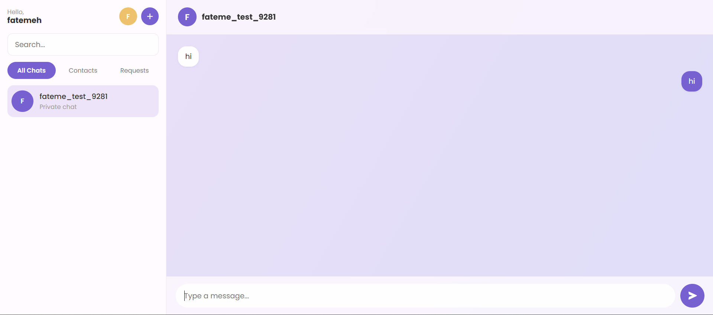
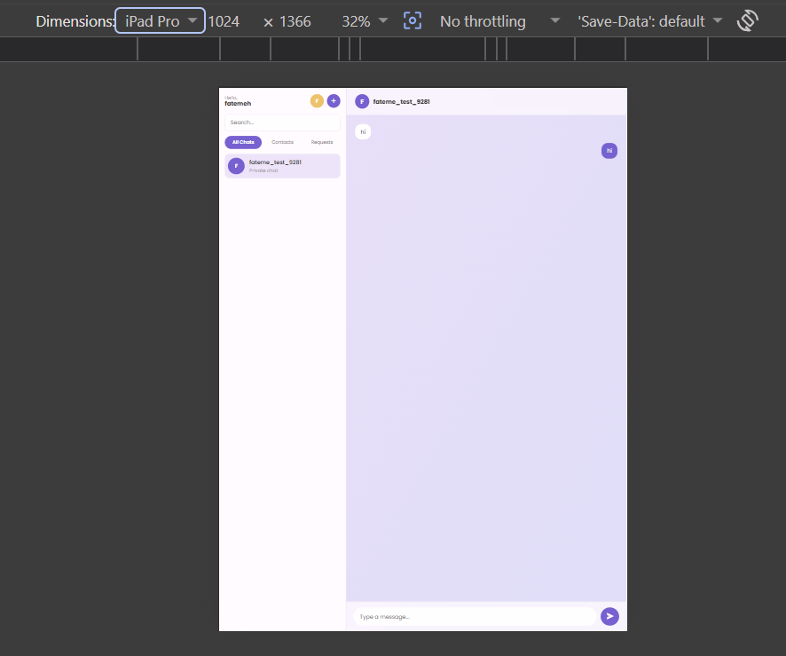

# 💬 Realtime Chat — Frontend

<p align="center">
  <strong>A modern real-time messaging frontend built with Angular 22</strong>
</p>

<p align="center">
  A responsive chat application with authentication, conversations,
  friends, user search, profile management and real-time WebSocket communication.
</p>

<p align="center">


</p>

<p align="center">
  🚧 <strong>Active Development</strong>
</p>

---

## 📸 Application Preview

### 🔐 Login



### 📝 Register



### 💬 Chat



### 📱 Mobile



---

# ✨ About The Project

**Realtime Chat — Frontend** is a modern Single Page Application built with
**Angular 22** for a real-time messaging platform.

The frontend provides the client-side experience for authentication,
real-time messaging, conversations, friends, friend requests, user search,
and profile management.

The application communicates with the backend through two main channels:

- 🌐 **REST API** — authentication, users, profiles, friends, conversations and messages
- ⚡ **WebSocket** — real-time messaging and connection events

The project follows a modern Angular architecture using:

- Standalone Components
- Angular Signals
- RxJS
- Reactive Forms
- Route Guards
- HTTP Interceptors
- Dedicated Services
- Strongly typed TypeScript models

The main goal of the project is to provide a clean, responsive and
maintainable frontend architecture while delivering a smooth real-time
messaging experience.

---

# 🚀 Features

## 🔐 Authentication

The application provides a complete authentication flow.

### Current functionality

- User registration
- User login
- Logout
- Access token management
- Refresh token handling
- Protected routes
- Authentication Guard
- HTTP Authentication Interceptor

### Authentication Flow

```text
┌─────────────────────┐
│   Login / Register  │
└──────────┬──────────┘
           │
           ▼
┌─────────────────────┐
│      REST API       │
│   Authentication    │
└──────────┬──────────┘
           │
           ▼
┌─────────────────────┐
│ Access + Refresh    │
│       Tokens        │
└──────────┬──────────┘
           │
           ▼
┌─────────────────────┐
│  Authentication     │
│       Guard         │
└──────────┬──────────┘
           │
           ▼
┌─────────────────────┐
│   Chat Application  │
└─────────────────────┘